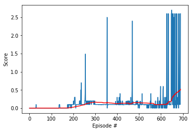
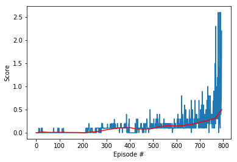
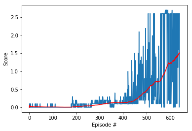
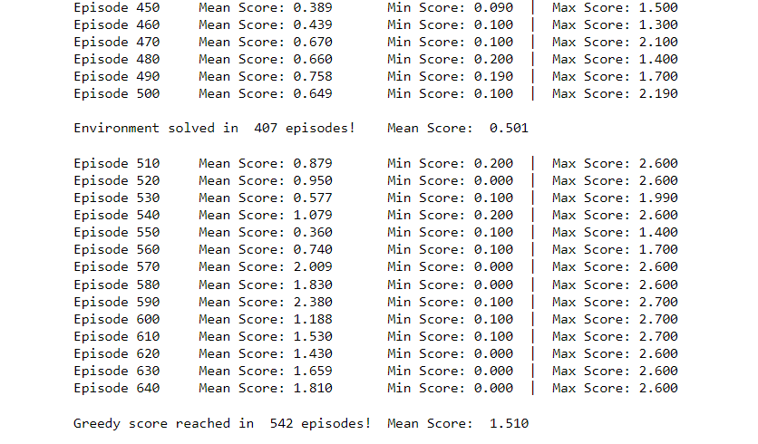

# Udacity Deep Reinforcement Learning Nanodegree
## Project 1: Navigation

#### &nbsp;

### Report
#### 1. Architecture components

For this project, it was implemented a simple DDPG model combine with an experience replay buffer, both developed in the previous projects. The structure of the model was quite simple on its core and the approach to the problem was equally narrow since only one agent was created and used to take the actions of both players, therefore having to learn from two points of view.

I selected this approach since actions only vary in one aspect and it is the direct to which the agent has to return the ball, and what started as a simple experiment turn out to be true, which is that this information has to be contain inside the space vector since this agent was able to solved the environment quite successfully.

#### 2. Hyperparameters

As in the 1st project, the hyperparameter selection was based on the recommendations from the [Rainbow paper](https://arxiv.org/pdf/1710.02298.pdf) by Deep Mind with slight modifications in some values.

  | Parameter                           | Value         |
  | ----------------------------------- | ------------- |
  | Replay buffer size                  | 1e6           |
  | Batch size                          | 128           |
  | Minimum experience required         | 4096 tuples   |
  | Discount Factor γ                   | 0.99          |
  | Soft Update τ                       | 7e-3          |
  | Adam learning rate α                | 6.25e-5       |
  | Prioritization type                 | Proportional  |
  | Prioritization exponent ω           | 0.5           |
  | Weights correction β                | 0.4           |
  | Correction increase rate            | 7e-6          |
  | Learning steps                      | 4             |
  | Learning updates iterations         | 3             |
  | Ornstein-Uhlenbeck factor θ         | 0.15          |
  | Ornstein-Uhlenbeck factor σ         | 0.2           |
  | Number of episodes                  | 2000          |
  | Exploration ε                       | 1.0           |
  | Epsilon minimum                     | 0.01          |
  | Epsilon decay                       | 1e-4          |
  | Epsilon decay type                  | linear        |

This project's network consisted of two linear layers, both with 256 units, and both followed by a ReLU activation function. The final linear layer had the same units number as the action space size, but applying a tanh activation function for the Actor's output, whereas the Critic was left with no activation in the final layer.

#### 3. Results

At first, I decided to train a simple agent to trace a base line of what to expect out the training, and although the behavior was a bit unstable, the results were surprisingly good. The agent took 590 episodes to solve the environment, having an average reward of 0.502 points in the last 100 games.

Next, it was added to the system the possibility of saving a minimum of experiences before the training could began. Initially the agent only waited for the buffer to had a full batch of experiences to start learning, but after declaring the condition of having a minimum of 4096 experiences, t took just this little detail extracted from the Rainbow paper to obtain a decent enough training stability showed in the Second Agent's graph. This new agent took longer to solve the environment, requiring 694 episodes to achieved a 0.519 reward average out of the last 100 games.

Both graphs are presented right below:

| Raw agent                    | Second Agent                                     |
|------------------------------| ------------------------------------------------ |
|  |            |

For the final agent, the prioritized replay buffer was added and though the raw agent without a minimum of experiences got to solved the environment in less episodes, its stability turn out to be the breaking point were it was preferable to train an agent that took longer with at a firm pass rather than an agent with perhaps an unexpected behavior.

Additionally, I let my greed took the wheel and aim for event better results, so I presented to values at the start of the training: the first one was the original value at which the environment is considered to be solved, the second one was three times higher value intended to test the agent and its capacity.

Both the reward plot and the training graph are presented right below:

| Training Graph                           | Reward Plot                            |
| ---------------------------------------- | -------------------------------------- |
|   |  |

Forward experiments reveal to me that this agent does not keep stable all the way through higher episodes, this could be caused by the fact that, as the agent gets closer to converge, the learning rate needs to decrease in order to avoid kickbacks in learning.

All weights are presented inside the `weights` folder. `main_actor_weights.pth` and `main_critic_weights.pth` represent the agent's weights at the moment where the environment was originally solved. `greedy_actor_weights.pth` and `greedy_critic_weights.pth` represent the agent's weights at the moment where the greedy goal was achieved.

#### 4. Ideas for Future Work

1. Add the missing extensions presented in the Rainbow paper, which are Dueling Network and the Distributional Reinforcement.
2. Search for hyperparameters that fit better to the environment, specially the learning rate.
